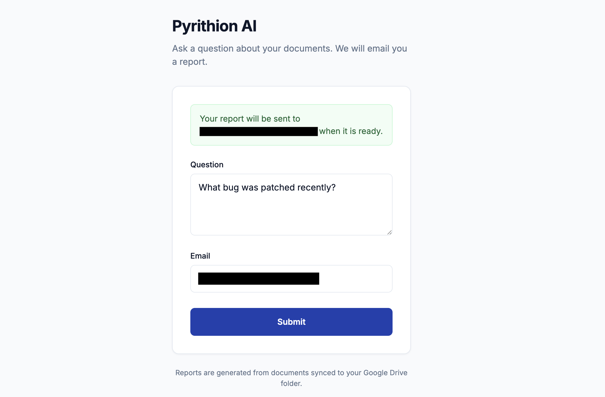
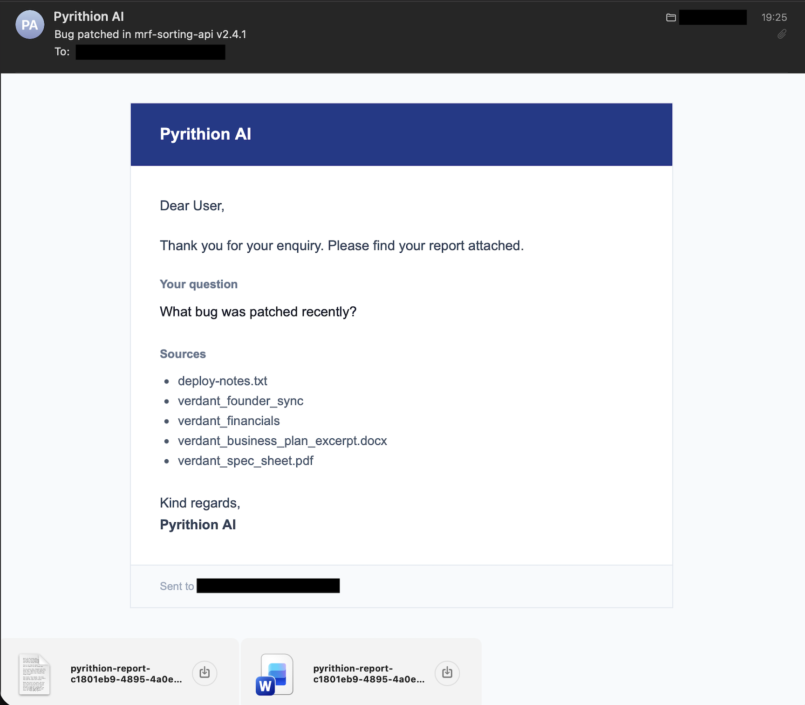
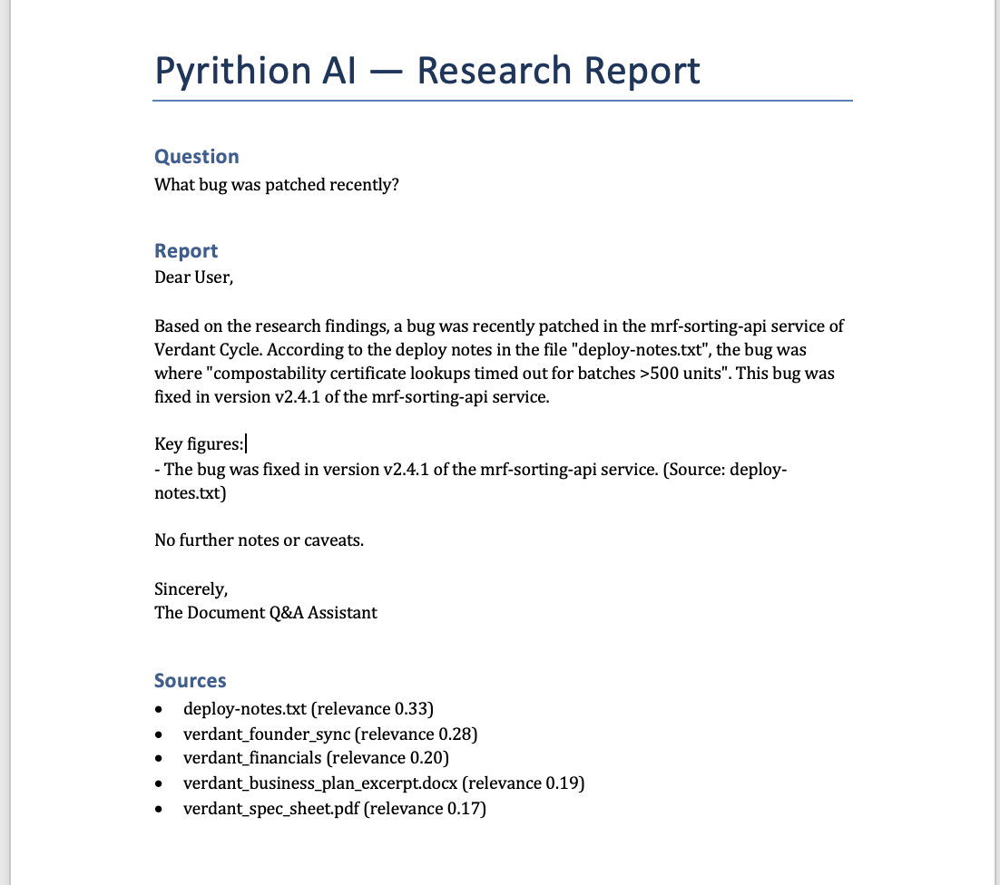

# Pyrithion AI

A multi-agent system that answers questions from Google Drive documents and delivers structured reports by email.

Pyrithion AI connects to a shared Google Drive folder, retrieves relevant content using vector search, and runs a pipeline of specialised agents to plan, research, write, and deliver a report.

## Features

- Web interface for question submission
- Google Drive document sync (Docs, Sheets, PDF, Word, CSV)
- Retrieval-augmented generation (RAG) over synced documents
- Multi-agent workflow: planner, research, writer, executor
- Email delivery with report attachments
- Optional SQL analytics against PostgreSQL
- Docker-based deployment

## Tech stack

| Layer | Technology |
|-------|------------|
| API | FastAPI, Uvicorn |
| Agents | Custom orchestrator, OpenRouter (Claude Haiku) |
| Vector store | Qdrant |
| Embeddings | OpenAI text-embedding-3-small (via OpenRouter) |
| Database | PostgreSQL, asyncpg |
| Documents | Google Drive API, service account auth |
| Email | Resend API or SMTP |
| Templates | Jinja2 |
| Runtime | Docker Compose |
| Tests | pytest |

## Quick start

```bash
cp .env.example .env
cp credentials/google-service-account.json.example credentials/google-service-account.json
# Edit .env and credentials/google-service-account.json with your values
./start.sh
```

Open http://localhost:8000

## Configuration

See `.env.example` for all variables. Key settings:

- `GOOGLE_DRIVE_FOLDER_ID` and `GOOGLE_SERVICE_ACCOUNT_FILE` for document access
- `EMAIL_PROVIDER=resend` with `RESEND_API_KEY`, or SMTP settings
- `LLM_API_KEY` and `LLM_MODEL` for the agent LLM
- `IMAP_ENABLED=false` recommended until outbound email is verified

**Secrets:** `.env` and `credentials/*.json` are gitignored. Use `.env.example` and `credentials/*.example.json` as templates only.

## Architecture

```text
User question (web form)
       |
   Planner agent
       |
   Research agent (RAG / Google Drive)
       |
   Writer agent
       |
   Executor agent (email + attachments)
```

## Development

```bash
python -m venv .venv
source .venv/bin/activate
pip install -r requirements.txt
pytest
```

## Images

### Web interface

Users submit a question and delivery address through a simple form.



### Email notification

The agent sends an email confirming the enquiry, listing sources used, and attaching the report.



### Report attachment

Reports are delivered as Word and plain-text attachments with the question, analysis, key figures, and cited sources.



---

## License

MIT
